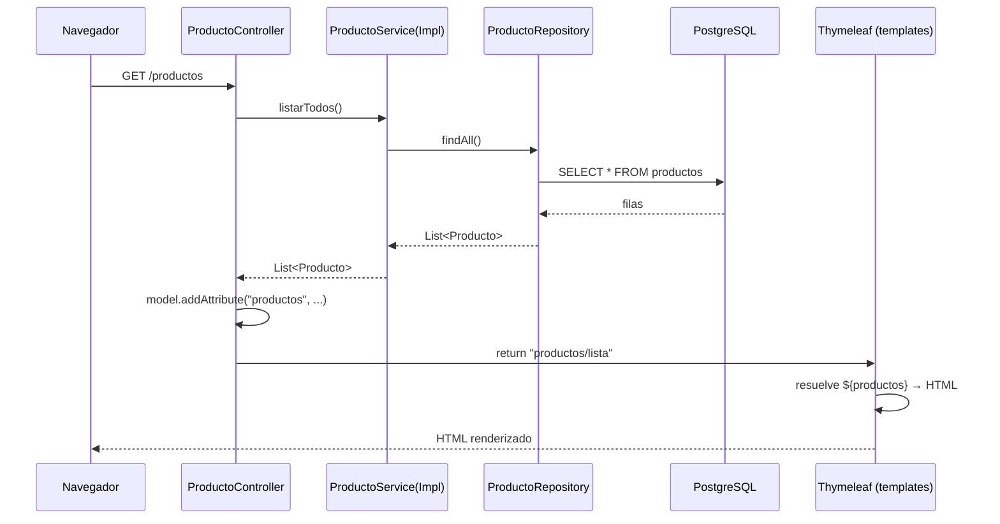

# Arquitectura MVC y su relación con el frontend (`templates`)

> Proyecto: **Spring Store (`tienda`)** — aplicación monolítica Java + Spring Boot 4.1.1 (Java 21), Thymeleaf como motor de vistas y JPA/Hibernate sobre PostgreSQL. CRUD de `Producto` construido siguiendo el patrón **MVC** y principios SOLID.

Este documento describe **cómo se relacionan las capas del MVC con el frontend** ubicado en `src/main/resources/templates/`, y qué considerar al **expandir la lógica de negocio** y cómo ese cambio **afecta al resto de las capas**.

---

## 1. Mapa de la aplicación

```
src/main/java/pe/edu/empresa/tienda/
├── TiendaApplication.java          → Arranque (@SpringBootApplication)
├── controller/
│   ├── HomeController.java         → Controlador de la portada  "/"
│   └── ProductoController.java     → Controlador CRUD           "/productos"
├── model/
│   └── Producto.java               → Entidad JPA (@Entity) = Modelo de dominio
├── repository/
│   └── ProductoRepository.java     → Acceso a datos (JpaRepository)
└── service/
    ├── ProductoService.java        → Contrato de negocio (interfaz)
    └── ProductoServiceImpl.java    → Reglas de negocio + validación

src/main/resources/
├── application.properties          → Configuración (BD, JPA, puerto)
└── templates/                      → VISTA (frontend Thymeleaf)
    ├── index.html                  → Portada
    ├── css/styles.css              → Estilos propios (sirve como recurso estático)
    └── Productos/
        ├── lista.html              → Tabla / listado
        ├── detalle.html            → Ficha de un producto
        └── formulario.html         → Alta y edición (formulario reutilizado)
```

### Cómo cada letra del MVC se materializa aquí

| Letra | Rol | Dónde vive en el proyecto |
|-------|-----|---------------------------|
| **M** — Modelo | Datos + reglas de negocio | `model/Producto.java` (estado) + `service/` (comportamiento) + `repository/` (persistencia) |
| **V** — Vista | Presentación HTML | `templates/**/*.html` (Thymeleaf) + `templates/css/styles.css` |
| **C** — Controlador | Traduce HTTP ↔ negocio | `controller/HomeController`, `controller/ProductoController` |

> Nota conceptual: en Spring MVC el objeto `org.springframework.ui.Model` que recibe el controlador **no es el "Modelo" del patrón**, sino el *contenedor de datos* que el controlador llena para pasárselos a la Vista. El "Modelo" del patrón es la entidad `Producto` junto con la capa de servicio/repositorio.

---

## 2. El flujo completo: del clic al HTML

Cada interacción del usuario recorre las capas en un único sentido de ida y vuelta:



Puntos clave del flujo:

1. **El controlador nunca habla con la base de datos ni con Thymeleaf directamente.** Delega negocio en `service` y solo devuelve el **nombre lógico de la vista** (`"productos/lista"`).
2. **El puente Controlador → Vista es el objeto `Model`.** Todo lo que la plantilla necesita debe colocarse ahí con `model.addAttribute("clave", valor)`.
3. **La vista es de solo lectura sobre el modelo:** Thymeleaf lee `${clave}` en el servidor y produce HTML final. El navegador nunca ve Thymeleaf, solo HTML plano.

---

## 3. El contrato Controlador ↔ Vista (lo más importante)

La relación entre el MVC y el frontend se reduce a **un contrato de nombres**: el atributo que el controlador mete en el `Model` y la clave que la plantilla lee tienen que **coincidir exactamente**. Esta es la tabla que hay que respetar al tocar cualquiera de los dos lados:

| Ruta HTTP | Método controlador | Vista devuelta | Atributo(s) en `Model` | La plantilla espera… |
|-----------|--------------------|-----------------|------------------------|-----------------------|
| `GET /` | `HomeController.inicio()` | `index` | — (ninguno) | Nada dinámico |
| `GET /productos` | `listar()` | `productos/lista` | `productos` → `List<Producto>` | `th:each="producto : ${productos}"` |
| `GET /productos/{id}` | `detalle()` | `productos/detalle` | `producto` → `Producto` | `${producto.nombre}`, `.id`, `.descripcion`, `.precio`, `.stock` |
| `GET /productos/nuevo` | `nuevo()` | `productos/formulario` | `producto` → `new Producto()` | `th:object="${producto}"` (campos vacíos) |
| `POST /productos` | `guardar()` | redirect `/productos` | recibe `@ModelAttribute Producto` | (envío del formulario) |
| `GET /productos/{id}/editar` | `editar()` | `productos/formulario` | `producto` → existente | `th:object="${producto}"` (precargado) |
| `POST /productos/{id}` | `actualizar()` | redirect `/productos` | recibe `@ModelAttribute Producto` | (envío del formulario) |
| `POST /productos/{id}/eliminar` | `eliminar()` | redirect `/productos` | — | Botón dentro de `<form method="post">` |

### 3.1 Enlace de datos en las plantillas

**Salida (mostrar datos) — `lista.html` y `detalle.html`:**
```html
<!-- Itera la lista que el controlador puso como "productos" -->
<tr th:each="producto : ${productos}">
    <td th:text="${producto.id}"></td>
    <td th:text="${producto.nombre}"></td>
    <td th:text="${'S/ ' + producto.precio}"></td>
</tr>

<!-- Caso vacío controlado desde la vista -->
<div th:if="${#lists.isEmpty(productos)}">No existen productos registrados.</div>
```
`producto.nombre` invoca en realidad el *getter* `getNombre()` de la entidad. **La vista depende de los getters del modelo, no de los campos.**

**Entrada (capturar datos) — `formulario.html`:**
```html
<form th:object="${producto}"
      th:action="${producto.id == null} ? @{/productos} : @{/productos/{id}(id=${producto.id})}"
      method="post">
    <input th:field="*{nombre}"  required>
    <input th:field="*{precio}"  type="number" step="0.01" min="0.01" required>
    <input th:field="*{stock}"   type="number" min="0" required>
</form>
```
- `th:object` fija el objeto de respaldo del formulario (el `producto` del `Model`).
- `th:field="*{nombre}"` genera de golpe `id`, `name` y `value` del input, y **en el envío Spring lo vuelve a mapear** al `@ModelAttribute Producto producto` del controlador (data binding bidireccional por convención de nombres).
- **Un único formulario sirve para crear y editar**: la propia plantilla decide la acción según `producto.id == null`. Esa lógica de "modo" vive en la vista, no en el controlador.

### 3.2 URLs y recursos: `@{...}`

Todas las rutas y enlaces usan la sintaxis `th:href="@{/productos}"`. Nunca se escriben URLs a mano. Esto incluye el CSS propio:
```html
<link rel="stylesheet" th:href="@{/css/styles.css}">
```
> Detalle de configuración: `styles.css` está dentro de `templates/css/`. Funciona porque, por defecto, Spring Boot resuelve esa ruta mediante el `@{...}`, pero **la ubicación canónica de un CSS es `src/main/resources/static/css/`**. Ver §5 (consideraciones).

---

## 4. Relación entre capas — quién depende de quién

```
        Navegador (HTTP)
              │
              ▼
     ┌─────────────────┐        devuelve nombre de vista
     │   Controller    │ ───────────────────────────────► Vista (Thymeleaf)
     │  (@Controller)  │            + Model (datos)              ▲
     └────────┬────────┘                                        │
              │ usa la interfaz ProductoService                 │ lee getters
              ▼                                                  │
     ┌─────────────────┐                                         │
     │    Service      │  ← reglas de negocio + validación       │
     │ (interfaz+Impl) │                                         │
     └────────┬────────┘                                         │
              │ usa ProductoRepository                           │
              ▼                                                  │
     ┌─────────────────┐                                         │
     │   Repository    │  ← JpaRepository (CRUD auto)            │
     └────────┬────────┘                                         │
              │                                                  │
              ▼                                                  │
        PostgreSQL  ◄──────── Producto (@Entity) ────────────────┘
```

Reglas de dependencia que sostienen el diseño (y que conviene **no romper** al expandir):

- **Dirección única:** `Controller → Service → Repository → BD`. Ninguna capa inferior conoce a la superior.
- **Inversión de dependencias (la "D" de SOLID):** el controlador depende de la **interfaz** `ProductoService`, no de `ProductoServiceImpl`. La implementación se inyecta por constructor. Se puede sustituir la lógica sin tocar el controlador.
- **El repositorio es una interfaz vacía** que hereda todo el CRUD de `JpaRepository<Producto, Long>`. Spring Data genera la implementación en tiempo de ejecución.
- **La entidad `Producto` atraviesa todas las capas** (BD ↔ repo ↔ service ↔ controller ↔ vista). Es a la vez tabla, objeto de negocio y respaldo del formulario. Esto es simple y directo, pero es también el punto que más "vibra" cuando el modelo crece (ver §5.3).

---

## 5. Consideraciones al expandir la lógica de negocio

Aquí está el núcleo de lo pedido: **qué cambiar, dónde, y qué se arrastra** cuando el negocio crece. Cada escenario indica el "efecto dominó" sobre el resto de capas.

### 5.1 Añadir un campo nuevo al producto (p. ej. `categoria`)

Un cambio aparentemente pequeño toca **todas** las capas por el hecho de que la entidad se comparte de extremo a extremo:

| Capa | Qué hay que tocar |
|------|-------------------|
| Modelo | `Producto.java`: nuevo campo + `@Column` + getter/setter + (opcional) parámetro del constructor |
| Base de datos | Con `spring.jpa.hibernate.ddl-auto=update` Hibernate **agrega la columna sola**; en producción se recomienda una migración explícita (Flyway/Liquibase) |
| Servicio | Añadir la copia del campo en `actualizar()` y, si aplica, su regla en `validarProducto()` |
| Vista `formulario.html` | Nuevo `<input th:field="*{categoria}">` |
| Vista `lista.html` / `detalle.html` | Nueva columna/fila si debe mostrarse |

> **Efecto dominó clave:** olvidar copiar el campo en `ProductoServiceImpl.actualizar()` produce un bug silencioso — el formulario envía el dato pero la edición nunca lo persiste, porque `actualizar()` copia campo por campo manualmente.

### 5.2 Añadir o cambiar una regla de validación

Toda la validación vive hoy en **un solo lugar**: el método privado `validarProducto()` de `ProductoServiceImpl` (nombre obligatorio, precio > 0, stock ≥ 0). Es el punto correcto para centralizar reglas de negocio.

- **Ventaja del diseño actual:** el controlador no valida nada; añadir una regla no obliga a tocar controladores ni rutas.
- **Efecto sobre la vista:** hoy, si la validación falla, el servicio lanza `IllegalArgumentException` y **no hay manejo de errores** → el usuario ve una página de error 500 de Spring, y **se pierde lo que había escrito** en el formulario. Al expandir, casi siempre querrás:
  1. Migrar a **Bean Validation** (`@NotBlank`, `@Positive`, `@Min(0)`) en la entidad o en un DTO, y validar en el controlador con `@Valid` + `BindingResult`.
  2. Devolver de nuevo la vista `formulario` con los mensajes `th:errors` en lugar de redirigir, para conservar los datos y mostrar el error junto al campo.

### 5.3 Separar la entidad de la vista con un DTO (recomendado al crecer)

Hoy la entidad `Producto` se usa **directamente** como `@ModelAttribute` del formulario. Esto es cómodo pero acopla el HTML al esquema de base de datos y abre la puerta a *mass-assignment* (el formulario podría intentar setear campos que no debería).

- **Cuándo introducir un `ProductoDto` / `ProductoForm`:** en cuanto haya campos calculados, campos que el usuario no debe editar, o validaciones distintas entre "crear" y "editar".
- **Efecto dominó:** aparece una capa de **mapeo DTO ↔ entidad** (manual o con MapStruct) en el servicio o el controlador; las plantillas pasan a enlazar contra el DTO (`th:object="${productoForm}"`) en vez de la entidad. El repositorio y la BD no se enteran.

### 5.4 Añadir una operación de negocio nueva (p. ej. "descontar stock al vender")

El camino de expansión respeta la dirección de dependencias:

1. **Declararla en la interfaz** `ProductoService` (`descontarStock(Long id, int cantidad)`).
2. **Implementarla** en `ProductoServiceImpl` con su regla (no permitir stock negativo, marcar `@Transactional` si toca varias entidades).
3. **Exponerla** con un nuevo método en `ProductoController` que devuelva una vista o un `redirect:`.
4. **Conectar el frontend**: un nuevo `<form method="post" th:action="@{...}">` o botón en la plantilla correspondiente.

> Regla práctica: **la lógica va siempre en `service`, nunca en el controlador ni en la plantilla.** El controlador solo orquesta y elige vista; la plantilla solo presenta. Si te ves poniendo un `if` de negocio en el HTML, es señal de que ese cálculo debe subir al servicio y llegar ya resuelto en el `Model`.

### 5.5 Crecimiento del frontend: fragmentos y layout común

Cada plantilla repite hoy su propio `<head>`, el `<link>` de Bootstrap y la barra de navegación. Al añadir páginas esto se vuelve difícil de mantener.

- **Solución Thymeleaf:** extraer un `fragments/layout.html` con `th:fragment` (cabecera, navbar, footer) y reutilizarlo con `th:replace` / `th:insert`. Un cambio de menú se hace una sola vez.
- **Efecto:** es un refactor **solo de la capa Vista**; controladores, servicios y modelo no cambian. Es la prueba de que las capas están bien separadas.

### 5.6 Errores y páginas de estado

No existe un `@ControllerAdvice` global. Al expandir, un manejador de excepciones centralizado permite mapear `IllegalArgumentException` → página 400 amigable, y `Producto no encontrado` → página 404, sin ensuciar cada método del controlador con `try/catch`.

---

## 6. Puntos de atención detectados (checklist antes de expandir)

Observaciones concretas del estado actual del código que conviene tener presentes:

1. **Sensibilidad a mayúsculas en el nombre de la vista.** Los controladores devuelven `"productos/lista"`, `"productos/detalle"`, `"productos/formulario"` (en minúscula), pero la carpeta física es `templates/Productos/` (con **P mayúscula**). En Windows funciona porque el sistema de archivos **no distingue mayúsculas**; al desplegar en **Linux/Docker fallará con `TemplateInputException`**. Recomendación: unificar todo a `templates/productos/` en minúscula.
2. **`styles.css` bajo `templates/css/`.** Lo canónico en Spring Boot es `src/main/resources/static/css/`. Conviene moverlo para evitar depender del comportamiento por defecto del *resource handling*.
3. **Doble driver de base de datos en `pom.xml`.** Están declaradas dependencias de **PostgreSQL** *y* **SQL Server (`mssql-jdbc`)**, y además Thymeleaf/JPA aparecen **duplicados**. `application.properties` apunta solo a PostgreSQL. Limpiar el POM evita confusión y conflictos de versiones.
4. **`ddl-auto=update`.** Cómodo en desarrollo, arriesgado en producción (Hibernate altera el esquema en caliente). Migrar a Flyway/Liquibase antes de ir a producción.
5. **Sin manejo de errores ni mensajes de validación en la UI** (ver §5.2 y §5.6).
6. **Sin paginación** en `listarTodos()` → `findAll()`. Con muchos productos, la tabla de `lista.html` cargará todo. `JpaRepository` ya ofrece `findAll(Pageable)` cuando se necesite.

---

## 7. Resumen de una línea por capa

- **Modelo (`Producto` + `service` + `repository`):** define *qué es* un producto y *qué se puede hacer* con él; es el único lugar con reglas de negocio.
- **Vista (`templates/`):** solo presenta datos que ya vienen resueltos en el `Model`; enlaza por *nombre de atributo* y por *getters*.
- **Controlador (`controller/`):** traduce HTTP a llamadas de servicio y elige qué vista renderizar; no contiene lógica de negocio.
- **Contrato que los une:** la coincidencia exacta entre `model.addAttribute("clave", …)` y `${clave}` en la plantilla. Romper ese nombre es la causa más común de fallo al expandir.
